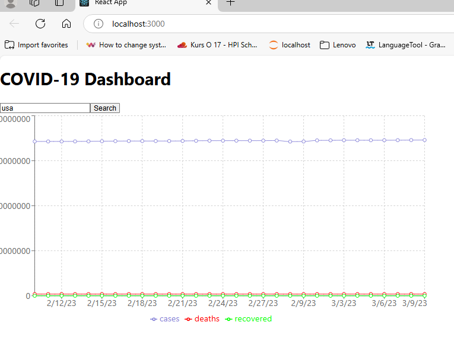

Here’s a comprehensive `README.md` for your COVID-19 Data Dashboard project. It explains the purpose of the project, the API being used, the Flask endpoints, and what users can do with the application.

---

# **COVID-19 Data Dashboard**

 <!-- Add a screenshot if available -->

This project provides a **COVID-19 Data Dashboard** that displays real-time COVID-19 statistics (cases, deaths, recoveries) by country. It uses a public API to fetch data and presents it in an easy-to-understand format using a Flask backend and a React frontend.

---

## **Features**
- **Real-Time Data**: Fetch and display the latest COVID-19 statistics for any country.
- **Historical Data**: View historical COVID-19 trends (cases, deaths, recoveries) for the past 30 days.
- **Search Functionality**: Search for a specific country to see its COVID-19 data.
- **Interactive Charts**: Visualize data using interactive line charts.

---

## **Technologies Used**
- **Backend**: Flask (Python)
- **Frontend**: React.js
- **API**: [disease.sh](https://disease.sh/docs/) (Free COVID-19 API)
- **Data Visualization**: Recharts
- **Containerization**: Docker
- **CI/CD**: GitHub Actions

---

## **API Used**
This project uses the [disease.sh](https://disease.sh/docs/) API, which provides real-time and historical COVID-19 data. The following endpoints are used:

1. **Get COVID-19 Statistics for All Countries**  
   Endpoint: `https://disease.sh/v3/covid-19/countries`  
   Description: Fetches the latest COVID-19 statistics (cases, deaths, recoveries) for all countries.

2. **Get Historical COVID-19 Data for a Specific Country**  
   Endpoint: `https://disease.sh/v3/covid-19/historical/{country}?lastdays=30`  
   Description: Fetches historical COVID-19 data (cases, deaths, recoveries) for the past 30 days for a specific country.

---

## **Flask Endpoints**
The Flask backend acts as a proxy for the external API and provides the following endpoints:

1. **Get COVID-19 Statistics**  
   Endpoint: `/api/covid/stats`  
   Method: `GET`  
   Description: Fetches the latest COVID-19 statistics for all countries.

2. **Get Historical COVID-19 Data**  
   Endpoint: `/api/covid/historical/<country>`  
   Method: `GET`  
   Description: Fetches historical COVID-19 data for the past 30 days for a specific country.

---

## **What Can Users Do?**
1. **View Real-Time Data**:  
   Users can see the latest COVID-19 statistics (cases, deaths, recoveries) for any country.

2. **Search for a Country**:  
   Users can search for a specific country to view its COVID-19 data.

3. **View Historical Trends**:  
   Users can view historical COVID-19 trends (cases, deaths, recoveries) for the past 30 days.

4. **Interactive Charts**:  
   Users can interact with line charts to visualize COVID-19 trends over time.

---

## **Getting Started**

### **Prerequisites**
- Docker
- Docker Compose
- Python 3.9+
- Node.js 16+

---

### **Installation**
1. Clone the repository:
   ```bash
   git clone https://github.com/your-username/covid-dashboard.git
   cd covid-dashboard
   ```

2. Build and run the application using Docker Compose:
   ```bash
   docker-compose up --build
   ```

3. Access the application:
   - Backend: `http://localhost:5000`
   - Frontend: `http://localhost:3000`

---

### **Running Tests**
To run the unit tests for the Flask backend:
```bash
cd backend
python -m unittest tests/test_app.py
```

---

### **CI/CD Pipeline**
This project uses GitHub Actions for CI/CD. The pipeline:
1. Runs unit tests for the Flask backend.
2. Builds Docker images for the backend and frontend.
3. Pushes the Docker images to Docker Hub (optional).

---

### **Project Structure**
```
covid-dashboard/
├── backend/               # Flask backend
│   ├── app.py             # Flask application
│   ├── requirements.txt   # Python dependencies
│   ├── Dockerfile         # Dockerfile for the backend
│   ├── tests/             # Unit tests
│       ├── test_app.py    # Test cases
├── frontend/              # React frontend
│   ├── src/               # React source code
│   ├── Dockerfile         # Dockerfile for the frontend
├── docker-compose.yml     # Docker Compose configuration
├── README.md              # Project documentation
```

---

## **Screenshots**

1. **Historical Trends**: 
   
